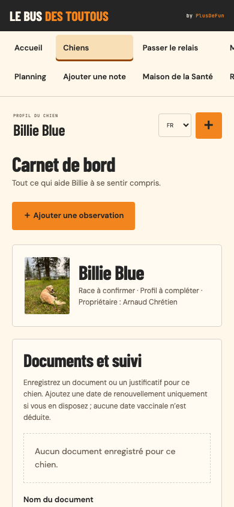
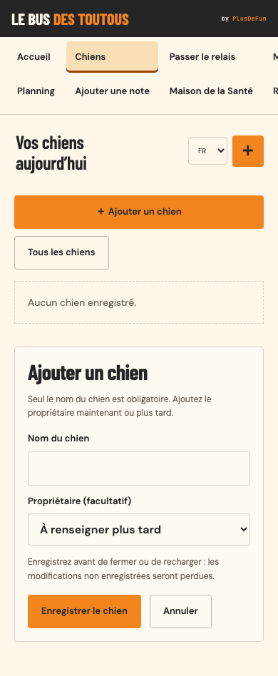
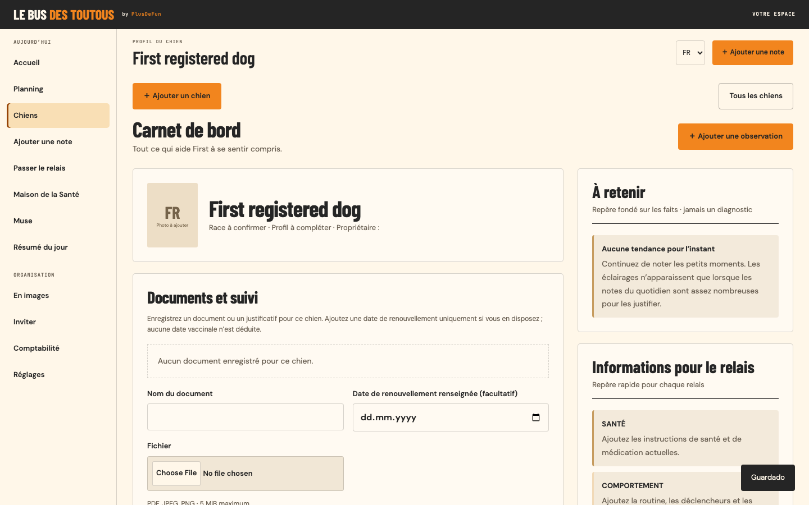

# Register a dog directly from Chiens

Before, Chiens opened the selected profile without a registration action. Creating a dog required a booking. Now **＋ Ajouter un chien** and **Tous les chiens** are available above the profile and for an empty directory.

| Before: phone profile | After: phone registration |
|---|---|
|  |  |

Screenshots use disposable fixtures. Registration requires a name only, accepts an optional recorded owner and opens the saved profile. Existing profiles, notes and accounting records remain intact. Different dogs can share a name without sharing an ID. Cancel, failed save/retry, duplicate submits, literal text across five locales, empty directories, reload, later booking association, tenant/revision guards, keyboard access and 44px controls are covered by the daily browser/API/model checks. Desktop1440×900, tablet1024×768 and phone390×844 are exercised with no page overflow. Per-dog tariffs and daily attendance are outside this change.
