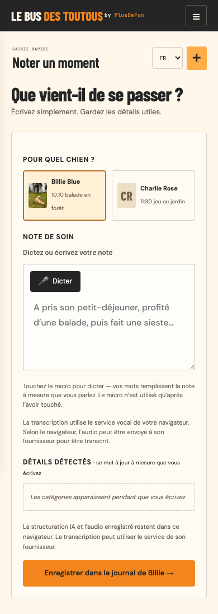
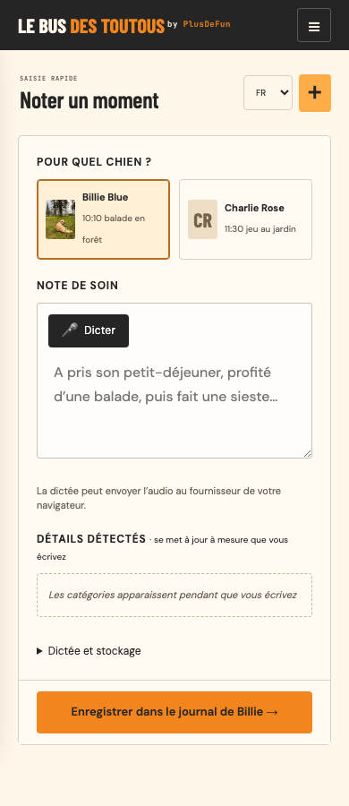
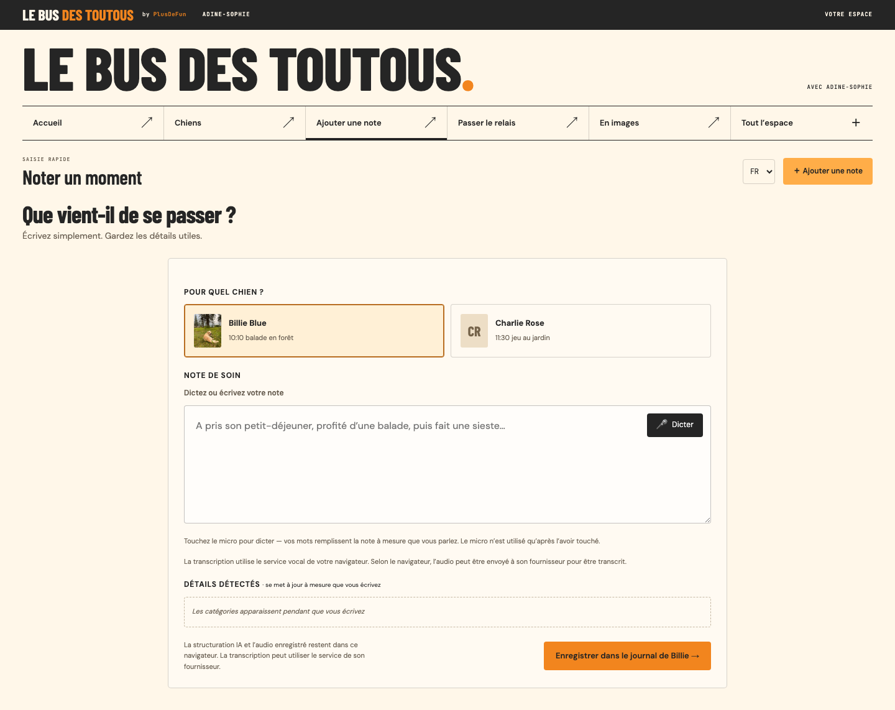
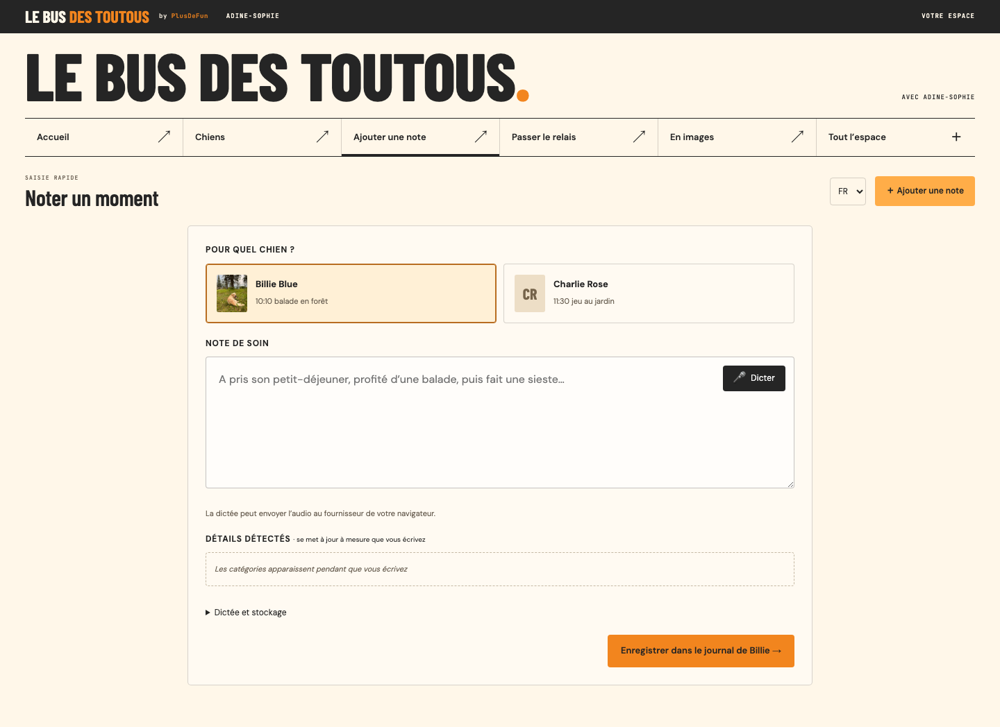

# Care-note capture on mobile

Historical capture review from 16 September 2026. The screenshots and coordinates below predate the [compact-navigation stage](../muse-compact-navigation/README.md) and the [current workspace](../../../README.md#navigate-the-workspace); they are measurements of that earlier layout, not the current one. The current phone layout fixes the Save area above the visual viewport's bottom inset and reserves space beneath the form; the document-flow description below records this earlier revision.

The Save button previously began 1000 px below the top of a 390 × 844 viewport. The revised form retains the existing visual identity and dog context, removes the repeated introductory heading and keeps Save within reach.

| View | Before | After |
| --- | --- | --- |
| 390 × 844 |  |  |
| 1440 × 1000 |  |  |

Screenshots are full-page captures using the existing fictional care records and default French language. Measurements describe the initial viewport, not the taller full-page image: [before](before-measurements.json), [after](after-measurements.json). At 390 × 844, Save moves from y=1000 to y=772, ending at y=819. Dictate, both dogs and their context remain present.

## Behavior and disclosure

- The mobile Save/error area follows the visual viewport when its height or offset changes. Safe-area padding leaves space above a device's home indicator. It stays in the document flow, so expanded help can scroll clear of it.
- A visible notice reads “Dictation may send audio to your browser provider.” French: “La dictée peut envoyer l’audio au fournisseur de votre navigateur.” The same new notice and help label are translated into all five supported languages.
- “Dictation and storage” expands the existing full speech-service, microphone-activation and mode-specific storage explanations. Microphone activation, transcription, storage and draft handling are unchanged. Live speech statuses and save errors remain outside the disclosure.
- The Save action still names the selected dog. Its error message is retained beside the button. Selected dog controls expose their pressed state.

## Verification

On 16 September 2026, all 93 Python/browser tests passed with Playwright 1.61.0, and all 17 Node adapter tests passed. `node --check app.js` and `git diff --check` also passed.

The browser suite checks the short visible provider notice and expandable full disclosure in both storage modes. New regression checks cover Save at 390 × 844, 320 × 568 and 390 × 420; expanded help clearing the Save area; saving from a short viewport; and simulated visual-viewport shrink/pan followed by restoration. Existing regressions cover independent dog drafts, corrected dictation, reload persistence, account isolation and failed writes.

Real microphone transcription and a physical phone keyboard are not exercised by these automated checks. The visual-viewport test simulates the browser event; a real-device check remains a release follow-up. No data format, account setup or deployment configuration changes.
