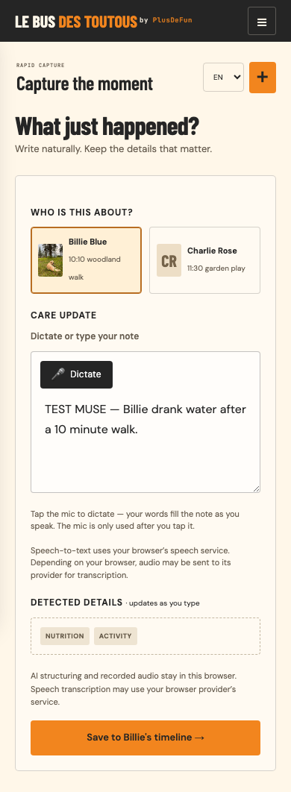

# Care-note journey review — 15 September 2026

The tested journey is select dog → write → correct → save → reload → find → prepare handover → open the source note. All observations introduced by these checks are labelled TEST. No owner update or invitation was sent.

## Reproduced problems and resulting behavior

| Trigger | Before (`3cbc5cc`) | After |
|---|---|---|
| Tap the selected dog while writing | The textarea becomes empty. | The draft remains. Other dogs keep separate drafts, including across navigation and language changes. |
| Browser refuses an observation write | Capture closes and reports a successful save although storage did not change. | Capture remains editable with a persistent failure alert. Retrying after recovery saves exactly one note. |
| Reopen a prior-day note’s handover | Real notes saved as `Today` remain in the current day indefinitely. | New notes use local calendar dates; supported legacy timestamp IDs determine their day without rewriting history. |

### Same action, before and after

Each image shows the capture form after reselecting the already-selected dog, at a 390-pixel viewport. The note was entered before the tap in both cases.

| Before: draft erased | After: draft retained |
|---|---|
|  |  |

Additional evidence: [failed save retains the editable draft](after-storage-failure.png), [corrected French note in the handover](after-handoff.png).

## Verification

- Full Python/browser suite: **89 tests passed**, covering static and account modes, API/tenant boundaries, speech mocks and mobile layout.
- Node API adapter suite: **17 tests passed**.
- Evidence capture: three focused static-browser tests passed at 390 × 844; no console errors in those cases. Screenshots show full pages, so their image height exceeds the viewport.
- New checks exercise a real click into the textarea, separate drafts, exact text across language changes, storage failure/retry, reload, source navigation, local midnight in Europe/Paris, legacy dates, delayed transcription results after Stop, manual corrections and callbacks from a previous dog’s dictation.
- An independent read-only review found no remaining findings after its three initial findings were fixed and covered by regression cases.
- Syntax and whitespace checks passed.

The two existing audio-save fixtures now attach their simulated recording after opening capture, matching draft ownership. Their upload-wait, failure-retention and single-save assertions are unchanged.

## Limits and next check

Unsaved drafts live only while the tab is open; closing/reloading still requires saving first. Low-numbered demo records retain their illustrative Today/Yesterday labels. No backend, account, checkout, infrastructure or saved-data migration is introduced.

Speech recognition is simulated in the automated checks. A real microphone/provider, a real phone keyboard and an uncoached carer have not been tested by this run. The [French pilot exercise](pilot-check-fr.md) is ready for that check after the corrected version is released. This review does not claim that release or human test has happened.

The project’s `AGENTS.md` requires explicit approval before external release for stored-data compatibility changes. This branch is prepared for review; merging to main would publish it through the existing GitHub Pages setup.

Design context: [Fi’s daily timeline](https://mobbin.com/flows/9576f61b-ed09-4f72-80b9-83bf2bc73802) and [Finch’s direct-entry flow](https://mobbin.com/flows/4d96c492-4c50-4bfe-b47d-e2010335187c) informed the focus on dog ownership, preserving work and clear completion. The approved visual layout is retained.
